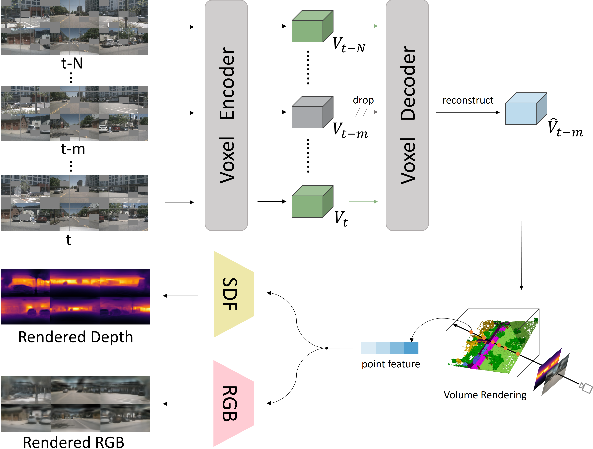

<div align="center">
<h1>MIM4D </h1>
<h3>Masked Modeling with Multi-View Video for Autonomous Driving Representation Learning</h3>

[Jialv Zou](https://github.com/Doctor-James)<sup>1</sup> \*, [Bencheng Liao](https://github.com/LegendBC)<sup>1,2</sup> \*, [Qian Zhang](https://scholar.google.com/citations?user=pCY-bikAAAAJ&hl=zh-CN)<sup>3</sup>, [Wenyu Liu](http://eic.hust.edu.cn/professor/liuwenyu/)<sup>1</sup>, [Xinggang Wang](https://xinggangw.info/)<sup>1 :email:</sup>
 
<sup>1</sup>  School of EIC, HUST, <sup>2</sup>  Institute of Artificial Intelligence, HUST,   <sup>3</sup> Horizon Robotics

(\*) equal contribution, (<sup>:email:</sup>) corresponding author.

**IJCV 2025**

ArXiv Preprint ([arXiv 2403.08760](https://arxiv.org/abs/2403.08760))
</div>


#


### News

* **` May. 22nd, 2025`:** The full code is released.
* **` Apr. 25th, 2025`:** MIM4D is accepted to IJCV 2025!
* **` Mar. 14th, 2024`:** We released our paper on Arxiv. Code/Models are coming soon. Please stay tuned! ☕️


## Abstract
Learning robust and scalable visual representations from massive multi-view video data remains a challenge in computer vision and autonomous driving. Existing pre-training methods either rely on expensive supervised learning with 3D annotations, limiting the scalability, or
focus on single-frame or monocular inputs, neglecting the temporal information. We propose MIM4D, a novel pre-training paradigm based on dual masked image modeling (MIM). MIM4D leverages both spatial and temporal relations by training on masked multi-view video inputs. It 
constructs pseudo-3D features using continuous scene flow and projects them onto 2D plane for supervision. To address the lack of dense 3D supervision, MIM4D reconstruct pixels by employing 3D volumetric differentiable rendering to learn geometric representations. 
We demonstrate that MIM4D achieves state-of-the-art performance on the nuScenes dataset for visual representation learning in autonomous driving. It significantly improves existing methods on multiple downstream tasks, including end-to-end planning (9% collision decrease), BEV segmentation (8.7% IoU), 
3D object detection (3.5% mAP), and HD map construction (1.4% mAP). Our work offers a new choice for learning representation at scale in autonomous driving.


<div align="center">

</div>

## Installation
```
conda create -n mim4d python=3.8
conda activate mim4d
conda install -y pytorch==1.13.0 torchvision==0.14.0 cudatoolkit=11.7 -c pytorch

pip install mmcv-full==1.7.1
pip install mmdet==2.28.2 mmsegmentation==0.30.0 tifffile-2023.7.10 numpy==1.19.5 protobuf==4.25.2 scikit-image==0.19.0 pycocotools==2.0.7 nuscenes-devkit==1.1.10 gpustat numba scipy pandas matplotlib Cython shapely loguru tqdm future fire yacs jupyterlab scikit-image pybind11 tensorboardX tensorboard easydict pyyaml open3d addict pyquaternion awscli timm typing-extensions==4.7.1

git clone git@github.com:hustvl/MIM4D.git
cd MIM4D
python setup.py develop --user
```
## Data Preparation
Please follow the instruction of [UVTR](https://github.com/dvlab-research/UVTR) to prepare the dataset.

## Training & Testing
You can train the model following the instructions. By modifying the following bash file, you can conduct experiments with different settings.
You can also find the pretrained models [here](https://huggingface.co/hustvl/MIM4D).
```
# train
bash ./extra_tools/dist_train_ssl.sh

# test
bash ./extra_tools/dist_test_ssl.sh
```
## Results

### UVTR
|                                             | NDS | mAP | Model |
|---------------------------------------------|:-------:|:-------:|:-------:|
|[uvtrs_mim4d_vs0.1](projects/configs/MIM4D/uvtr_convnext_s_vs0.1_finetune.py)| 32.6 | 32.3 | [pretrain](https://huggingface.co/hustvl/MIM4D/blob/main/uvtrs_mim4d_vs0.1/uvtrs_mim4d_vs0.1_pretrain.pth)/[ckpt](https://huggingface.co/hustvl/MIM4D/blob/main/uvtrs_mim4d_vs0.1/uvtrs_mim4d_vs0.1_finetune.pth)|
|[uvtrs_mim4d_vs0.075](projects/configs/MIM4D/uvtr_convnext_s_vs0.075_finetune.py)| 47.0 | 41.4 | [pretrain](https://huggingface.co/hustvl/MIM4D/blob/main/uvtrs_mim4d_vs0.075/uvtrs_mim4d_vs0.075_pretrain.pth)/[ckpt](https://huggingface.co/hustvl/MIM4D/blob/main/uvtrs_mim4d_vs0.075/uvtrs_mim4d_vs0.075_finetune.pth)|

### VAD
|                                             | L2 (m) | Col. (%) | Model |
|---------------------------------------------|:-------:|:-------:|:-------:|
|VAD_tiny| 0.71 | 0.29 | [ckpt](https://huggingface.co/hustvl/MIM4D/blob/main/vad_tiny_mim4d.pth)|

## Acknowledgements
We build our project based on
- [UniPAD](https://github.com/Nightmare-n/UniPAD)
- [HoP](https://github.com/Sense-X/HoP)
- [SDFStudio](https://github.com/autonomousvision/sdfstudio)
- [MMDetection3D](https://github.com/open-mmlab/mmdetection3d)

Thanks for their great works.

## Citation
If you find MIM4D is useful in your research or applications, please consider giving us a star 🌟 and citing it by the following BibTeX entry.

```bibtex
 @article{mim4d,
  title={MIM4D: Masked Modeling with Multi-View Video for Autonomous Driving Representation Learning},
  author={Jialv Zou and Bencheng Liao and Qian Zhang and Wenyu Liu and Xinggang Wang},
  journal={arXiv preprint arXiv:2403.08760},
  year={2024}
}
```
